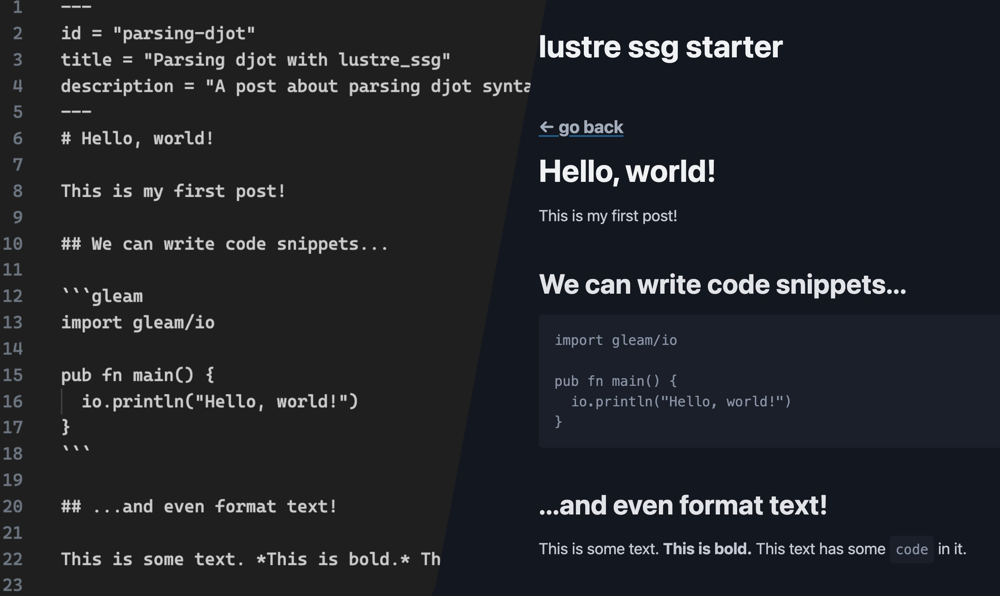

# `lustre_ssg` starter template

This is a dead simple demo repo to show you how to get started _today_ with
[`lustre`](https://hexdocs.pm/lustre/lustre.html) and [`lustre_ssg`](https://hexdocs.pm/lustre_ssg/index.html).

This template uses the markup syntax [`djot`](https://djot.net/) which is parsed with [`lustre_ssg/djot`](https://hexdocs.pm/lustre_ssg/lustre/ssg/djot.html) which is in turn powered by [`jot`](https://hexdocs.pm/jot/) to render content.

We use [PicoCSS](https://picocss.com/) as a sensible drop-in CSS framework.



## Getting started

Run `gleam run -m build` to generate the static HTML for your site. How you serve
it is up to you: everything you need to serve will be in the `dist/` directory.

## Adding pages

Add a new page by creating another djot file inside `src/content/`, for example `src/content/your_new_page.dj`.

In the build script you can then add it to the pipeline like so:

```gleam
pub fn main() {
  ssg.new("./dist")
  |> ssg.add_static_route("/", page(render("./src/content/index.dj"), "Home"))
  |> ssg.add_static_route("/your-new-page", page(render("./src/content/your_new_page.dj"), "Your new page!"))
  |> ...

```
